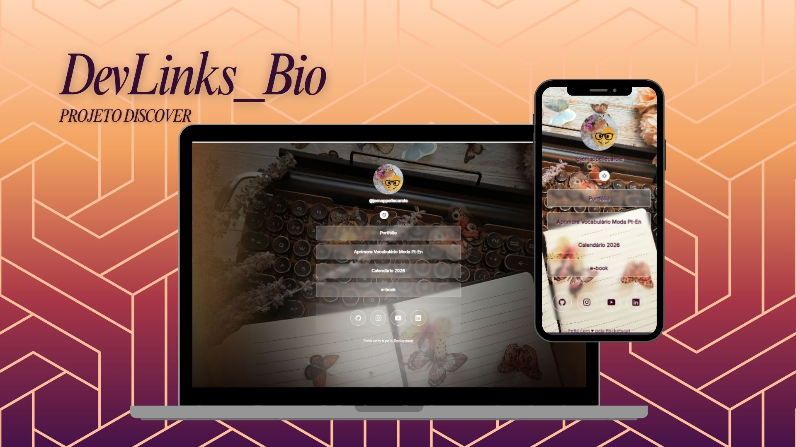

<h1 align="center"> DevLinks_Bio </h1>

Projeto desenvolvido em curso para iniciantes em Tecnologia- Discover, promovido pela Rocketseat para ensino de tecnologias WEB.

  <a href="#-tecnologias">Tecnologias</a>&nbsp;&nbsp;&nbsp;|&nbsp;&nbsp;&nbsp;
  <a href="#-projeto">Projeto</a>&nbsp;&nbsp;&nbsp;|&nbsp;&nbsp;&nbsp;
  <a href="#-layout">Layout</a>&nbsp;&nbsp;&nbsp;|&nbsp;&nbsp;&nbsp;
  <a href="#memo-licença">Licença</a>

  

 

  

## 🚀 Tecnologias

Esse projeto foi desenvolvido com as seguintes tecnologias:

- HTML e CSS
- JavaScript
- Git e Github
- Figma

## 💻 Projeto

O DevLinks_Bio é um agregador de links para usar como cartão de visitas online. Neste o público tem acesso ao conteúdo que a autora deseja compartilhar como portfólio e produtos digitais.

## 🔖 Layout

Você pode visualizar o layout do projeto através [DESSE LINK](https://www.canva.com/design/DAG81yMcWvM/-Mda3EqHKLxnriSVrczcoA/view?utm_content=DAG81yMcWvM&utm_campaign=designshare&utm_medium=link2&utm_source=uniquelinks&utlId=h915eb9c6c9/duplicate).

## :memo: Licença

Esse projeto está sob a licença MIT.

---

Feito com ♥ by Rocketseat :wave: [Participe da nossa comunidade!](https://discord.gg/rocketseat)

<!--START_SECTION:footer-->

 
 

  

<<<<<<< 

# <!--END_SECTION:footer-->

<!--END_SECTION:footer-->

> > > > > > >

